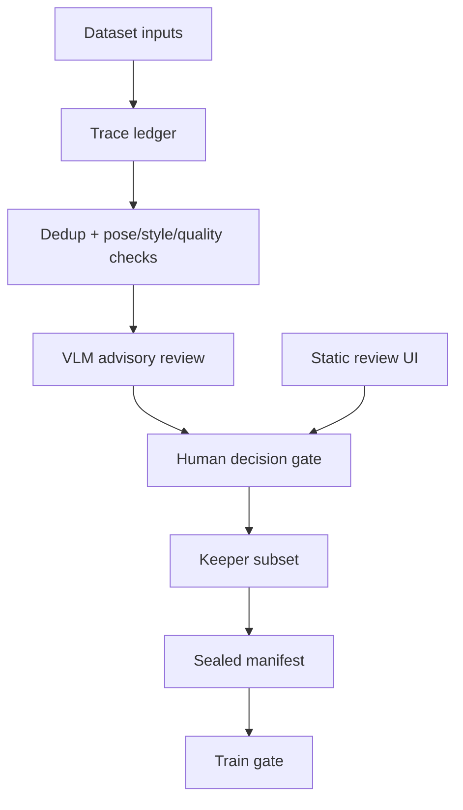
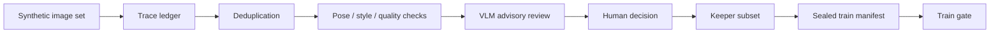

# AI Character Dataset And Training Pipeline

## Summary

Private implementation work around traceable dataset preparation for AI
character training, with a planned clean-room public demo.

## Stack Diagram

## What Existed Before

Character LoRA and related training workflows usually depend on many small
manual decisions: which images enter the dataset, which role each source has,
what should be rejected, and what becomes the final train subset. Generic
training scripts do not automatically explain those decisions or create a
reviewable evidence trail.

## What I Did

- Designed dataset preprocessing flows with source-role tracking.
- Added deduplication, quality checks, pose/style analysis, and review states.
- Used VLM-assisted advisory review while keeping the human decision gate
  explicit.
- Worked on sealed dataset manifests and train-gate discipline.
- Kept media, checkpoints, private datasets, and operational keys out of public
  publication scope.

## How I Extended It

The work turns dataset preparation into a reviewable process: every asset can
carry a role, status, reason, and lineage marker before it enters training.
VLM/Qwen-style review is treated as advisory, while the final decision remains
human-owned and auditable.

The future public demo should not publish private images. It should show the
method with synthetic fixtures: a toy dataset, a trace ledger, review states, a
sealed manifest, and a train gate that fails closed when evidence is missing.

## Diagram

## Why It Matters

This case demonstrates dataset governance, AI training preparation,
human-in-the-loop review, and reproducible evidence for a future service
contour.

## Skills

Dataset curation, lineage manifests, AI character training preparation,
VLM-assisted review, train gates, human-in-the-loop workflow, local review UI,
reproducible methodology documentation.

## Public Demo Plan

A future demo should use synthetic images and toy metadata to show the dataset
ledger, review states, seal manifest, and train gate without exposing private
training data or model artifacts.
