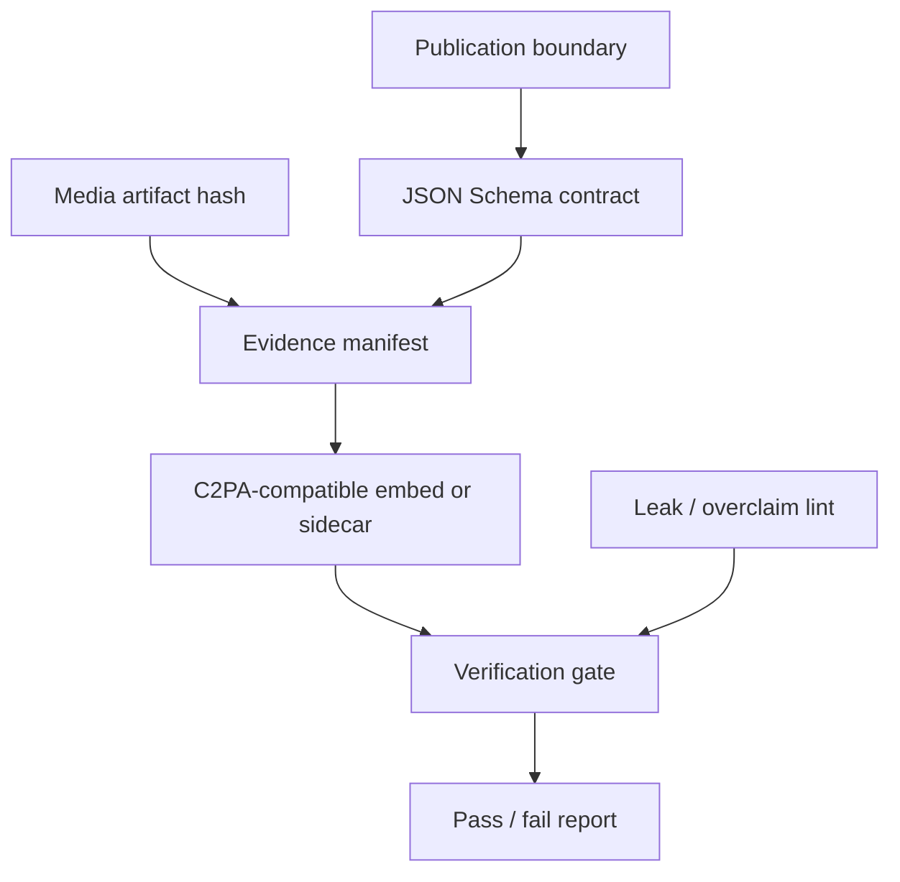
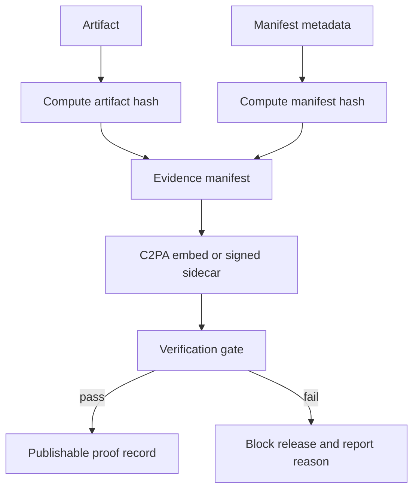

# AI Media Evidence Method

## Summary

Public-safe method description for traceable AI media workflows: manifests,
hashes, verification gates, seal-style watermark status fields, and
C2PA-compatible provenance framing.

## Stack Diagram

## What Existed Before

AI media workflows can produce valuable artifacts quickly, but the output chain
is often weakly documented: prompts, source roles, hashes, generated files,
post-processing steps, and publication claims live in separate places. Public
standards such as C2PA/Content Credentials provide a vocabulary for provenance,
but every production pipeline still needs a project-specific evidence contract
and fail-closed gate.

## What I Did

- Designed a manifest-first evidence contract for generated or processed media.
- Separated public method documentation from private implementation details.
- Defined pass/fail gates for missing manifests, hash mismatch, unsupported
  formats, invalid signatures, overclaims, and leakage.
- Kept trust-anchor, key-management, production storage, and customer workflow
  details out of public material.

## How I Extended It

The method adds a disciplined publication boundary around provenance work:
public docs show schemas, synthetic manifests, and limitations; private systems
can keep real keys, production storage, trust anchors, and customer workflows
outside public history.

The seal-style status is presented as a verification signal, not as a magic
rights-management claim. That distinction matters for interviews and public
proof: it demonstrates integrity engineering without overclaiming legal or DRM
properties.

## Diagram

## Why It Matters

This case shows security-adjacent product engineering: schemas, provenance,
integrity checks, public claim discipline, and publication safety for AI media
systems.

## Skills

Provenance design, content hashing, JSON Schema, verification gates,
publication safety, C2PA-compatible framing, public/private boundary management.

## Limitations

This method is tamper-evidence and provenance framing. It does not prevent
copying, prove copyright ownership, or replace legal/trust review.
