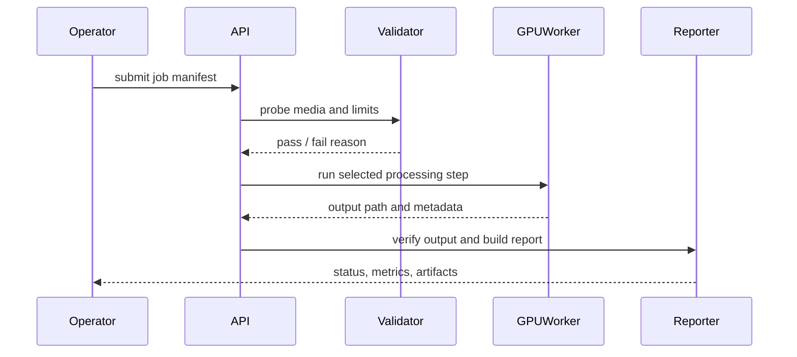

# AI Video Post-Production Pipeline

## Summary

Engineering work around GPU video processing, media validation, and
post-production APIs for AI media workflows.

## What Existed Before

Video super-resolution, depth estimation, segmentation, FFmpeg, and color
management tools existed as separate pieces. The missing layer was an
operator-friendly processing contour: accept a job, validate media, route work
to a GPU step, preserve metadata, and return an output that can fit a
post-production workflow.

## What I Did

- Designed job-style processing flows for heavy video operations.
- Worked with FFmpeg validation, codec controls, color/post-processing stages,
  and artifact metadata.
- Treated cloud GPU lifecycle and cost control as part of the engineering
  problem.
- Separated upstream model authorship from deployment, orchestration, and
  workflow integration work.

## How I Extended It

The contribution is the deploy and orchestration layer around upstream models:
API contracts, input validation, job status, guarded subprocess execution,
artifact metadata, color/post-processing steps, and run discipline for costly
GPU work.

The public demo should replace real model calls with a mock GPU worker and fake
media metadata, while preserving the engineering shape: request -> validate ->
process -> verify -> report.

## Diagram

## Why It Matters

This case shows how AI media tools become production systems: not only model
execution, but validation, cost-aware GPU operations, metadata, and predictable
operator handoff.

## Skills

Python APIs, GPU job orchestration, FFmpeg, video codecs, media metadata,
containerized runtimes, batch processing, validation, operator runbooks.

## Public Demo Plan

A clean-room demo should use fake media metadata and a mock GPU worker to show
job submission, validation, status tracking, and output reporting without
shipping private media, endpoints, hostnames, or credentials.
