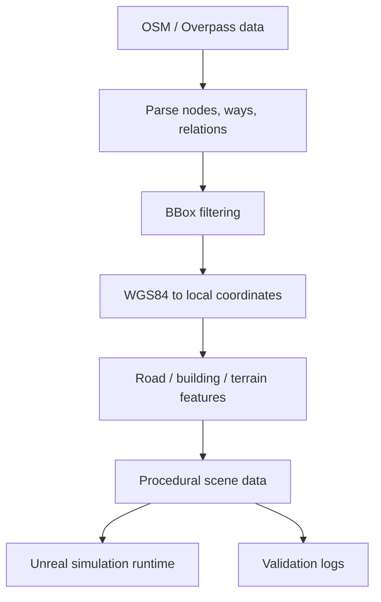

# Geospatial Simulation Tooling

## Summary

Simulation tooling experience around OpenStreetMap-style geodata, coordinate
conversion, procedural scene data, and Unreal Engine workflows.

## What Existed Before

OpenStreetMap/Overpass data provides raw geospatial structure: nodes, ways,
relations, roads, buildings, and multipolygons. Unreal Engine provides a
realtime scene/runtime environment. The missing piece is a translation layer
that turns public map data into validated simulation-ready geometry and
metadata.

## What I Did

- Worked with OpenStreetMap/Overpass-style input data.
- Parsed geodata concepts such as nodes, ways, relations, buildings, roads,
  and multipolygons.
- Implemented WGS84/local coordinate conversion and bounded-area processing.
- Connected geodata processing with procedural scene-generation workflows.
- Added validation and diagnostic outputs for generated spatial data.

## How I Extended It

The work is the pipeline between map data and simulation runtime: bounding-box
filtering, coordinate conversion, semantic parsing of OSM elements, procedural
road/building/terrain preparation, and diagnostic artifacts that make generated
scene data inspectable.

## Diagram

## Why It Matters

This case shows geospatial engineering inside realtime systems: public map data,
coordinate systems, procedural generation, validation, and Unreal-oriented
runtime preparation.

## Skills

OpenStreetMap, Overpass JSON, geospatial parsing, WGS84/local transforms,
procedural generation, Unreal Engine simulation data, terrain/building/road
pipelines, validation scripts.

## Public Boundary

This card describes the technical skill area without naming or publishing the
private implementation repository.
