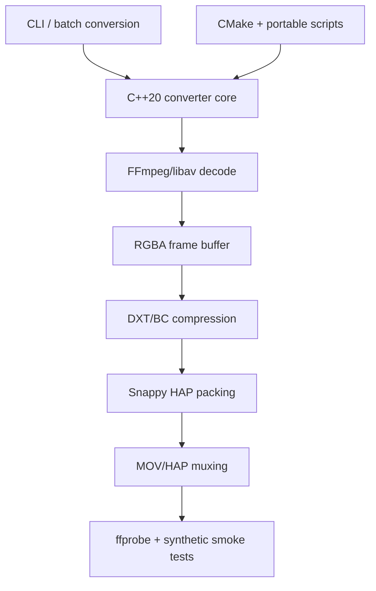

# HAP Converter

## Summary

Native multimedia tooling for realtime playback workflows: video decoding,
RGBA frame conversion, DXT/BC compression, Snappy packing, and MOV/HAP muxing.

## Stack Diagram

## What Existed Before

HAP is an established video codec family used in realtime playback, media
servers, installations, and VJ/LED workflows. FFmpeg/libav, Snappy, DXT/BC
compression libraries, CMake, and native GUI frameworks already existed as
building blocks. The engineering problem was not inventing HAP itself; it was
turning those low-level pieces into a practical local conversion tool.

## What I Did

- Developed and adapted a C++20 conversion pipeline around FFmpeg/libav.
- Implemented HAP-oriented decode -> RGBA -> DXT/BC -> Snappy -> MOV/HAP
  processing.
- Added native CLI-oriented build flow and batch conversion ergonomics.
- Worked on release hygiene: generated artifact cleanup, portable build
  scripts, path cleanup, and public-readiness checks.
- Verified the native CLI/core path with a local build and synthetic encode
  smoke test.

## How I Extended It

The important part is the integration layer: predictable native builds,
codec-specific constraints, format validation, and a workflow that can be used
by a media operator rather than only by a developer reading codec docs.

The public release path separates the core native converter from GUI/Wails
validation. That keeps the published claim honest: the CLI/core path is
verified; GUI packaging remains a separate gate.

## Diagram

## Why It Matters

This case shows low-level media engineering beyond AI wrappers: codec
constraints, native builds, binary dependencies, frame processing, and realtime
playback-oriented output validation.

## Skills

C++20, FFmpeg, libavcodec, libavformat, libswscale, HAP video, DXT/BC
compression, Snappy, CMake, native CLI tooling, media validation.

## Publication Status

The native CLI/core path has passed a local build and synthetic encode smoke
check in release review. Public visibility is still gated on full git-history
secret scanning and GUI/Wails validation.
