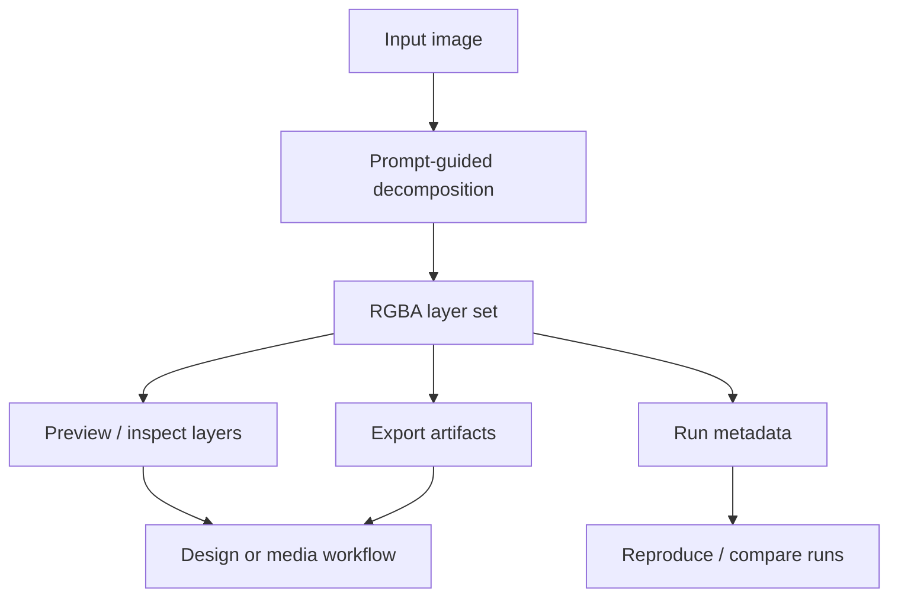

# Layered Image Workflows

## Summary

Adaptation work around layered image generation and decomposition workflows,
including Qwen-Image-Layered style RGBA layer extraction.

## What Existed Before

Qwen-Image-Layered and similar research/demo workflows already provide the core
idea: decompose an image into editable RGBA layers. The practical challenge is
making local inference, GPU memory, parameter control, export, and iteration
comfortable enough for design and media production use.

## What I Did

- Worked with prompt-guided image decomposition into editable RGBA layers.
- Adapted local inference and UI workflows for design/media production use.
- Used Gradio-style interaction, layer previews, export artifacts, and
  reproducible run metadata.
- Kept upstream model authorship distinct from local workflow customization.

## How I Extended It

The engineering work sits around the model: local model placement, CUDA/bfloat16
runtime choices, multi-GPU memory planning, repeatable parameters, per-run
metadata, layer previews, and export artifacts that a designer or motion
pipeline can actually consume.

## Diagram

## Why It Matters

This case bridges AI image generation and practical asset production: editable
layers, reproducible runs, parameter control, and downstream design use.

## Skills

Qwen-Image-Layered, PyTorch, CUDA, multi-GPU setup, bfloat16 inference, Gradio,
RGBA layers, prompt-guided decomposition, metadata logging, visual asset
pipelines.

## Public Links

- Public fork: https://github.com/Zudva/Qwen-Image-Layered
