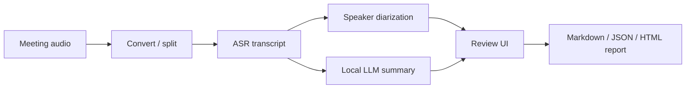

# Local Meeting AI Pipeline

## Summary

Local-first AI workflow for meeting audio: transcription, optional diarization,
summarization, and report generation.

## What Existed Before

Whisper/faster-whisper, diarization libraries, local LLMs, and web UI
frameworks are available as separate tools. The practical product problem is
turning a recorded meeting into a private, reviewable, structured output without
shipping audio or transcripts to a hosted service.

## What I Did

- Built local processing flows around faster-whisper/Whisper-style ASR.
- Integrated speaker diarization and fallback paths.
- Used local LLM summarization for structured notes and reports.
- Added a review UI concept for transcript, speaker naming, timeline, summary,
  and client-facing report outputs.
- Kept real audio, transcripts, participant names, customer data, and local
  operational config out of public scope.

## How I Extended It

The extension is the full workflow around the models: conversion, chunking,
ASR, optional diarization, relevance tagging, local summarization, report
formats, and a UI for review and speaker naming. This is the difference between
"run a transcription model" and "produce a usable meeting record".

## Diagram

## Why It Matters

This case demonstrates privacy-first automation: local AI processing, fallback
paths, structured outputs, and user-facing review surfaces.

## Skills

Speech-to-text, faster-whisper, speaker diarization, local LLMs, report
generation, Python, React/TypeScript UI, privacy-first processing, JSON,
Markdown, HTML reports.

## Public Demo Plan

A clean-room demo should use synthetic audio or generated transcript fixtures,
with no real client meetings or participant data.
