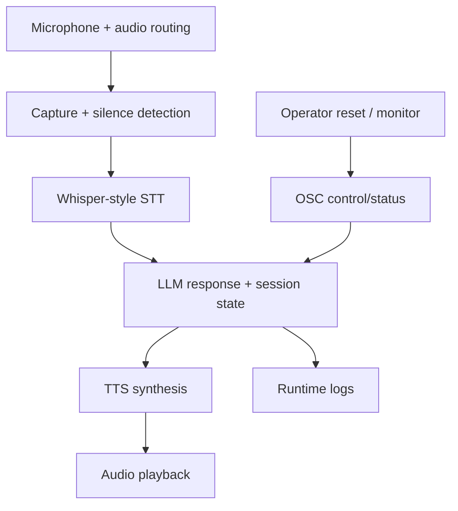
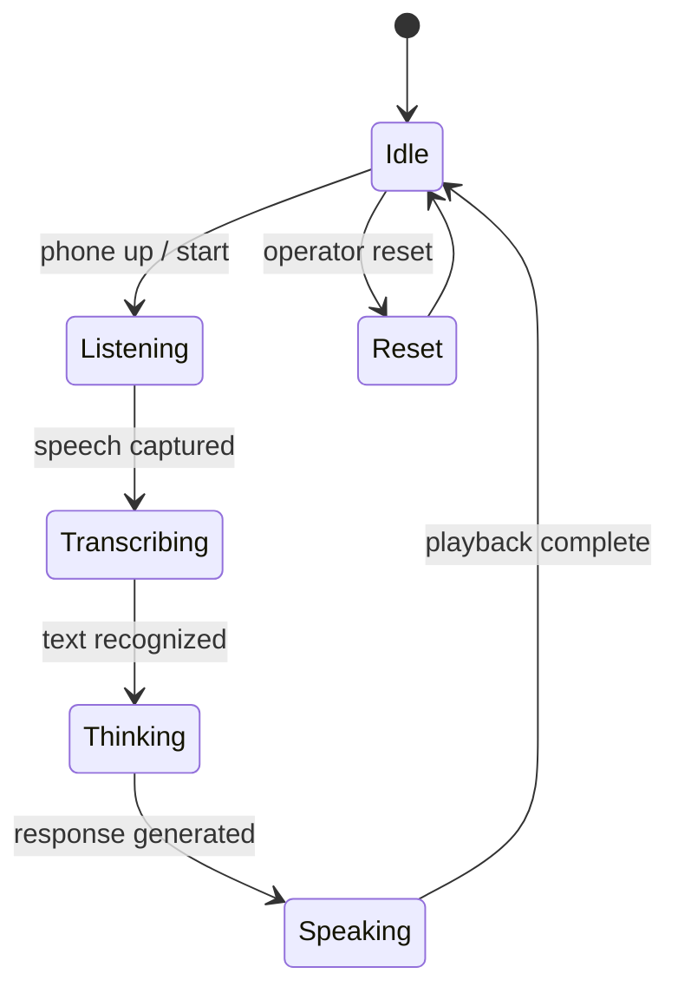

# Local Voice Installation

## Summary

Local conversational AI runtime for interactive installation scenarios.

## Stack Diagram

## What Existed Before

STT, LLM, TTS, audio-device libraries, and TouchDesigner/OSC style control
surfaces exist independently. The hard part is making them behave like one
installation-ready runtime with session state, operator controls, and predictable
audio routing.

## What I Did

- Built voice-assistant workflows with microphone input and audio routing.
- Used Whisper-style speech recognition, LLM response backends, TTS playback,
  and session state.
- Integrated OSC-style control/status messages for TouchDesigner-like
  installation control.
- Added operator-facing runtime behavior: reset commands, debug modes, logging,
  and device calibration.
- Kept real voices, persona datasets, generated audio, model artifacts, and
  credential history out of public scope.

## How I Extended It

The contribution is the runtime integration layer: microphone calibration,
silence thresholds, STT fallback behavior, persona/session state, response
generation, TTS playback, OSC control messages, reset/monitor commands, and
operator-readable logs.

## Diagram

## Why It Matters

This case shows applied local AI in a physical environment: voice input,
language model logic, audio playback, OSC integration, and operator-friendly
runtime behavior.

## Skills

Local LLMs, voice assistant runtime, Whisper STT, TTS, audio devices, session
management, OSC integration, TouchDesigner-style control, operator tooling,
runtime logging.

## Public Demo Plan

A clean-room demo should use synthetic persona text and generated short audio
fixtures, with no real actor/persona data or service credentials.
