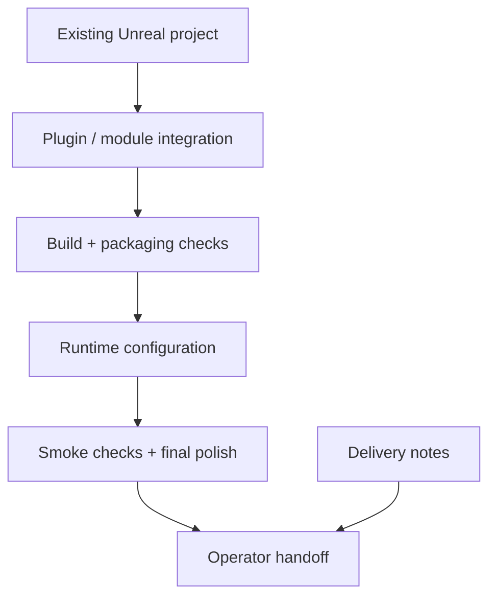
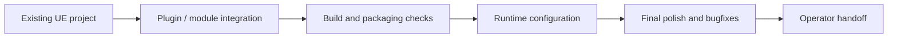

# Unreal Delivery And DevOps

## Summary

Applied Unreal Engine delivery experience focused on DevOps, final integration,
project finishing, packaging, and runtime handoff.

## Stack Diagram

## What Existed Before

The work happened in an existing Unreal Engine project environment with domain
logic, assets, plugins, and delivery constraints already in place. The public
claim is not authorship of the whole project. The claim is the engineering
slice around delivery, integration support, DevOps-style cleanup, packaging,
runtime checks, and final stabilization.

## What I Did

- Supported Unreal project delivery around build, packaging, runtime setup, and
  final polish.
- Worked at the boundary between engineering, content, deployment, and operator
  workflows.
- Avoided presenting private client/project mechanics as public source code.

## How I Extended It

The value was in making the project shippable: resolving integration seams,
checking runtime assumptions, helping package/build flow, cleaning up operator
steps, and closing final issues that block delivery. This is the kind of work
that sits between "code exists" and "the project can be handed off".

## Diagram

## Why It Matters

This case supports the CV claim that I can work inside complex realtime
projects, not only isolated scripts: Unreal build constraints, final delivery,
runtime behavior, and cross-functional handoff.

## Skills

Unreal Engine, build/package workflows, runtime configuration, plugin
integration, delivery support, deployment checks, operator documentation,
final-project stabilization.

## Public Boundary

This is intentionally described as a sanitized delivery case. Private project
names, client details, and implementation mechanics are not published here.
