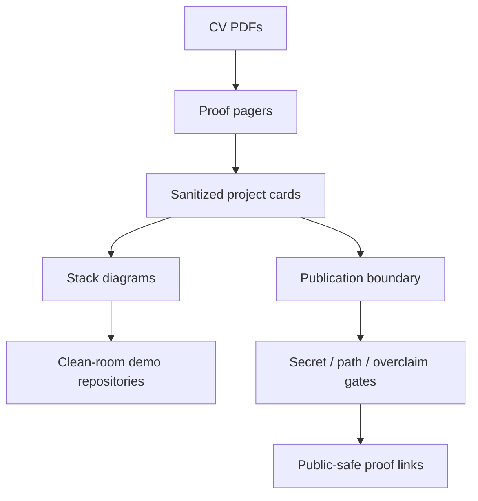
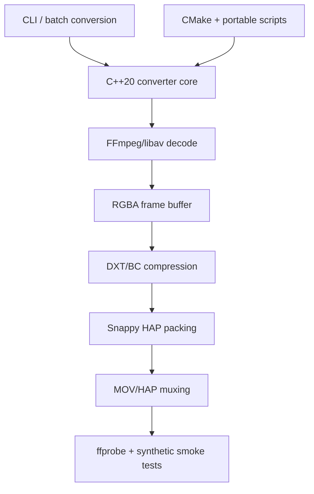
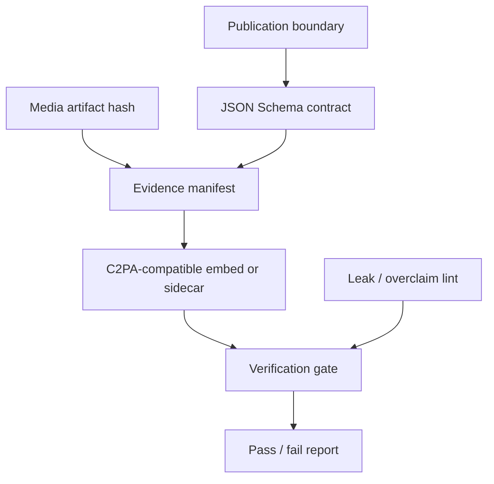
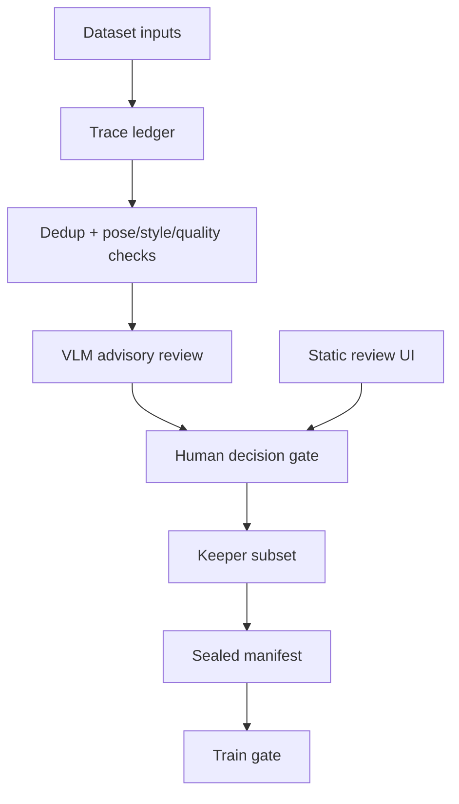
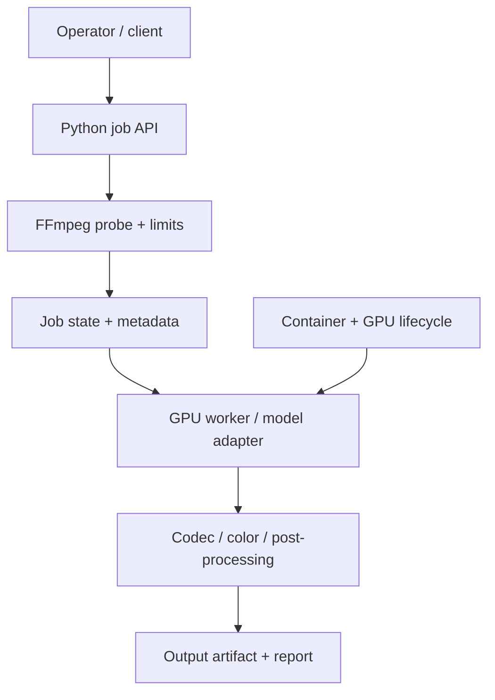
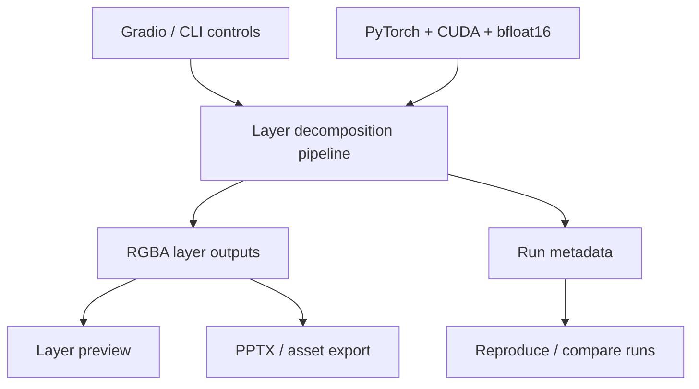
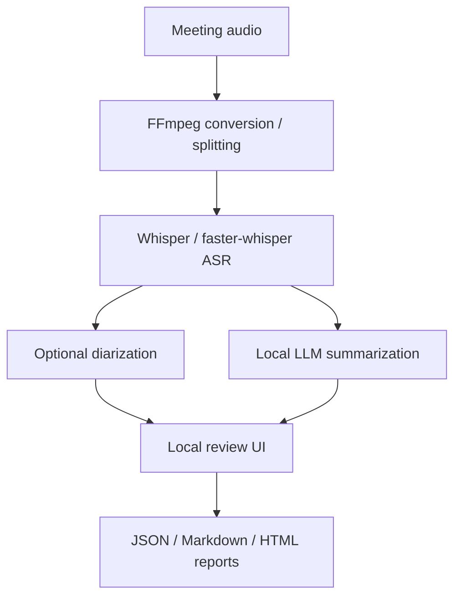
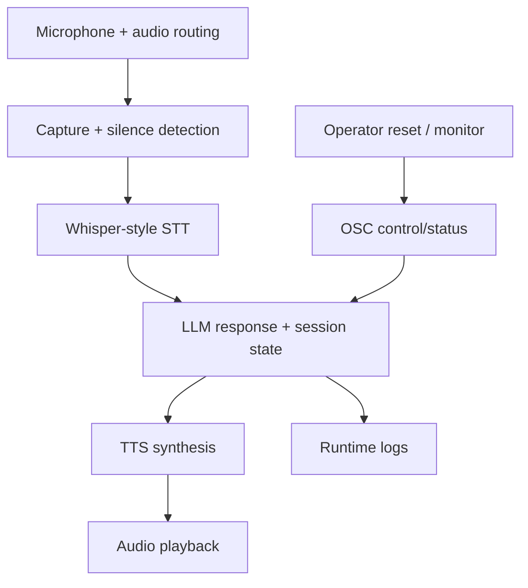
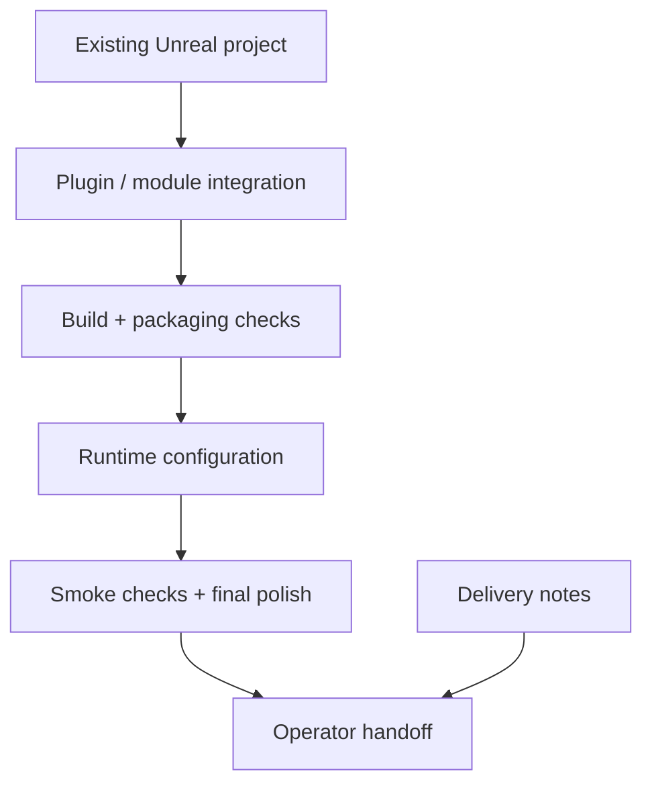
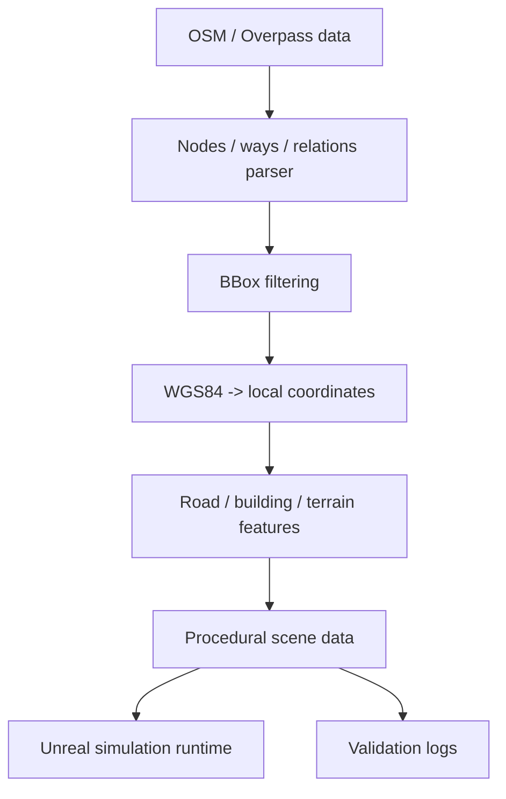

# Stack Diagrams

Public-safe stack diagrams for the portfolio project families. These diagrams
show technology layers and integration responsibility without exposing private
repositories, production paths, customer data, credentials, or operational
runbooks.

## Portfolio Evidence Stack

## HAP Converter

## AI Media Evidence Method

## AI Character Dataset And Training Pipeline

## AI Video Post-Production Pipeline

## Layered Image Workflows

## Local Meeting AI Pipeline

## Local Voice Installation

## Unreal Delivery And DevOps

## Geospatial Simulation Tooling

